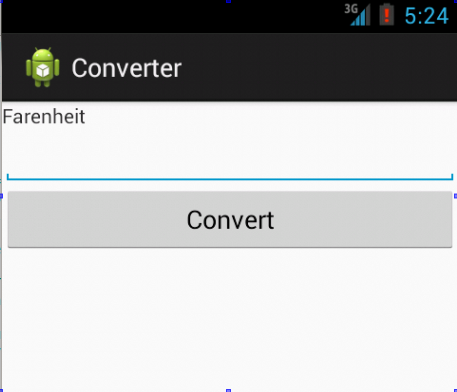

#A simple Android Application

In [Our First Application](firstApp.md "Notes for First android app") We've just developped a very simple android application, as illustrated below:


You have one text field, where you write a temperature in Farenheit, and a button for converting it; when pressing the button, the temperature in celsius degrees will be displayed.

We created the UI (the main view) by writing code that creates all the widgets in the right places; this is perfectly fine, and we can create complicated interfaces this way; however, Android also allows us to define our UI in XML, which is usually easier and more flexible (unfortunately, we cannot wire most events using XML, so we still need to write code for our UI).

If you look at the activity_main.xml file (inside res/layouts), you'll notice eclipse lets you edit it in graphical or raw-xml views (I switch among those constantly :)

The XML looks like this:
```xml
<RelativeLayout xmlns:android="http://schemas.android.com/apk/res/android"
    xmlns:tools="http://schemas.android.com/tools"
    android:layout_width="match_parent"
    android:layout_height="match_parent"
    android:paddingBottom="@dimen/activity_vertical_margin"
    android:paddingLeft="@dimen/activity_horizontal_margin"
    android:paddingRight="@dimen/activity_horizontal_margin"
    android:paddingTop="@dimen/activity_vertical_margin"
    tools:context=".MainActivity" >

    <TextView
        android:layout_width="wrap_content"
        android:layout_height="wrap_content"
        android:text="@string/hello_world" />

</RelativeLayout>
```
We have a `RelativeLayout` (layouts are widgets that contain and lay-out other widgets), which contains one `TextView`. In our previous tutorial, we used a LinearLayout, so let's change the RelativeLayour to a LinearLayout (you still need to leave the two xmlns declarations, that's how XML works); the android:padding arguments are not applicable to the LinearLayout, but we need to add a vertical orientation, leaving us with the following start of our XML

```xml
<LinearLayout xmlns:android="http://schemas.android.com/apk/res/android"
    xmlns:tools="http://schemas.android.com/tools"
    android:layout_width="match_parent"
    android:layout_height="match_parent"
    android:orientation="vertical"
    tools:context=".MainActivity" >
```

Now, we need to add all our widgets to this xml file; to allow us to get to the widgets in code, we want to give them a meaningful android:id, if we're going to use them in code. Our full XML file (including the LinearLayout above) would be:

```xml
<LinearLayout xmlns:android="http://schemas.android.com/apk/res/android"
    xmlns:tools="http://schemas.android.com/tools"
    android:layout_width="match_parent"
    android:layout_height="match_parent"
    android:orientation="vertical"
    tools:context=".MainActivity" >

    <TextView
            android:id="@+id/textView1"
            android:layout_width="match_parent"
            android:layout_height="wrap_content"
            android:text="Farenheit" 
    />

    <EditText
        android:id="@+id/faren"
        android:layout_width="match_parent"
        android:layout_height="wrap_content"
        android:ems="12" >

        <requestFocus />
    </EditText>

    <Button
        android:id="@+id/convertBtn"
        android:layout_width="wrap_content"
        android:layout_height="wrap_content"
        android:text="Convert" />

    <TextView
        android:id="@+id/celsius"
        android:layout_width="match_parent"
        android:layout_height="wrap_content"
    />
</LinearLayout>
```

The android build process does magic with our XML layouts; one piece of magic is to generate a class, called R (not a meaningful name, but easy to write), which will contain many constants, corresponding to our IDs (and a few other items).

When our xml contains id's like `android:id="@+id/celsius"`, (the + means to create a new id), the build process will generate a constant, R.id.celsius, which corresponds to the value assigned to that id.

In our `MainActivity.onCreate` method, we can use the `findViewById` method to find the view corresponding to that id. We would still need to create our class variables, and assign them in our onCreate method.

For example, for our code, we can create two instance variables, `TextView faren,celsius;`, and our onCreate would look like:

```
	protected void onCreate(Bundle savedInstanceState) {
		super.onCreate(savedInstanceState);
		setContentView(R.layout.activity_main);
		
		faren=(TextView) findViewById(R.id.faren);
		celsius=(TextView) findViewById(R.id.celsius);
		Button b=(Button)findViewById(R.id.convertBtn);
		b.setOnClickListener(new OnClickListener() {
			@Override
			public void onClick(View arg0) {
				double f=Double.valueOf(faren.getText().toString());
				double c=(f-32)/1.8;
				celsius.setText(Double.valueOf(c).toString());
			}		
		});
	}
```

Notice we need to do `setContentView` before we can do `findViewById`; also, notice the build process also creates a constant for our layouts, so we can refer to `R.layout.activity_main`.


##Extra Challenges:
1. Change the xml layout, so the label for the Farenheit temperature (at the very top) is to the left of the corresponding `EditText` (you need to create a horizontal layout). Add a label (TextView) displaying 'celsius' and put it to the left of the celsius label.
2. Convert the `TextView` that displays the temperature in celsius into an `EditText` so it is now editable, and add another button that converts from celsius into farenheit (may want to change the label of the first button also, since 'convert' is now not so meaningful :)
